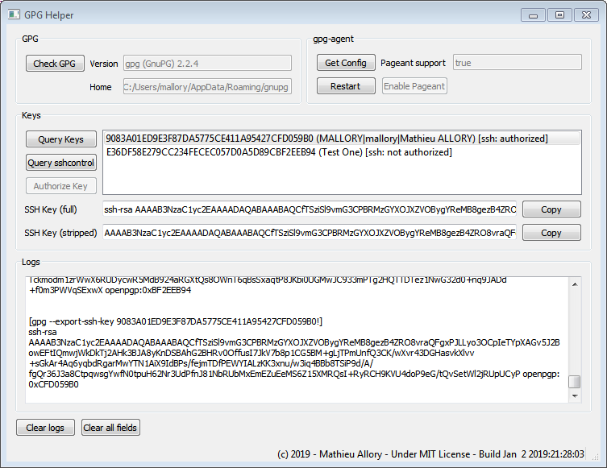

# gpghelper
A tool to help using SSH with GPG keys on Windows.

This small tool helps you having [putty](https://www.chiark.greenend.org.uk/~sgtatham/putty/) (pageant) based SSH client authenticating with GPG keys, which can be somewhat tricky for non-computer-guys.  
Is is intended to work under Windows with [GPG4WIN](http://www.gpg4win.com) package.
> **Note:** if you are using the cygwin flavor of GPG, this tool is not for you.

## Prerequisite
Install GPG4WIN with GnuPG version 2.2.4. GnuPG bin directory must be in the PATH.
If you like to build the software on your own, you will need [Qt](https://www.qt.io/) 5.6.1.
The tool basically parses gpg outputs, so gpgme is not required.

## Install
Download the latest portable build in folder [dist](dist/), extract it and run gpghelper.exe.
The portable archive contains libraries from [Qt](https://www.qt.io/) 5.6.1.

## Instructions
1. Start the tool
2. Configure GPG and gpg-agent
> gpg-agent must be started and a special option has to be enabled for it to work with putty-based windows software.
* Click on "Check GPG"
* Make sure that support for pageant is activated in gpg-agent by clicking on "Get Config". "Pageant support" shall indicate "true".
* If necessary, click on "Enable Pageant"
* Restart the agent by clicking on "Restart"

3. Configure your keys
>Your GPG keys will not be allowed to authenticate SSH connections out-of-the-box, they have to be authorized for that first.
* Click on "Query Keys". The list of available keys appears. They shall all show "[ssh: unknown]", which is normal for the moment.
* Click on "Query sshcontrol". The ssh authorization status shall be updated, for instance "[ssh: unauthorized]".
* Click on the key you like to authorize, then press "Authorize Key". The proper key is now added to the list of keys allowed to authenticate SSH sessions.
>Note that there must be a subkey with authentication role enabled, i.e. [A] flag for it to work.
* Restart the GPG agent by clicking on "Restart"
>Note that you shall also restart you application, otherwise it may ignore the changes until next restart !

4. Configure you SSH server
* Select the key you have authorized before, or another one which is authorized.
* The SSH fingerprint appears in fields "SSH Key". Most user will use "SSH Key (full)", which can be directly appended to your ~/.ssh/authorized_keys on your SSH server. "SSH Key (stripped)" is a convenience field that gives you only the central part with the key payload.

## Todo
* Code works but is not clean. Everything is put within the same class. At least, I should separate the gpg-related methods from the gui stuffs.
* Terrible lack of inline documentation.
* Robustness may be improved, probably.

## Author & more
Brought to you by Mathieu Allory: mathieu.allory _at_ gmail.com  
Software icon by [IconsMind](http://www.iconsmind.com)